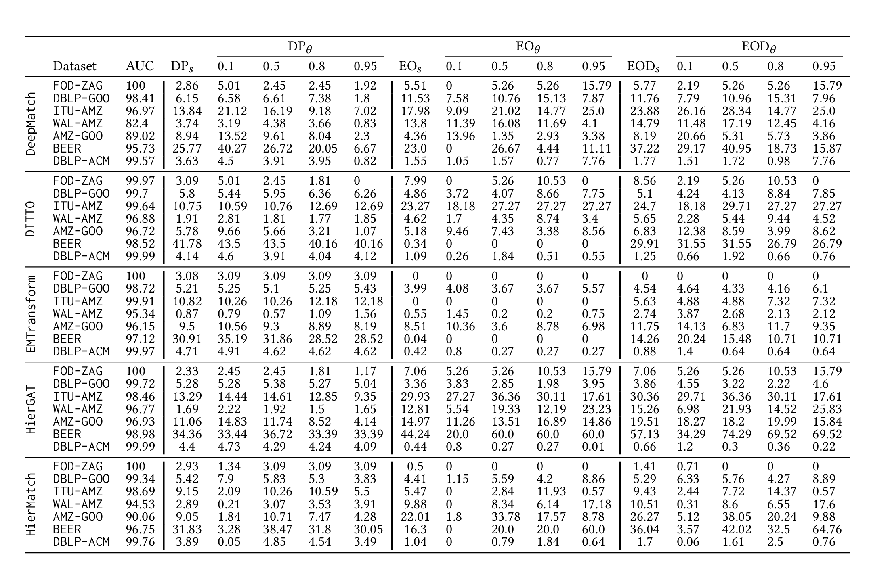

# FairEM 

## Overview

This repository contains the code and supplementary resources for the paper [**"Mitigating Matching Biases Through Score Calibration"**](https://arxiv.org/abs/2411.01685). Our work addresses biases in entity matching models by proposing a score calibration technique that minimizes disparities across different groups. By applying optimal transport-based calibration, we ensure fairness across matching outcomes, with minimal loss in model accuracy.

## Introduction

Record matching, the task of identifying records that correspond to the same real-world entities across databases, is critical for data integration in domains like healthcare, finance, and e-commerce. While traditional record matching models focus on optimizing accuracy, fairness issues have attracted increasing attention. Biased outcomes in record matching can result in unequal error rates across demographic groups, raising ethical and legal concerns. Existing research primarily addresses fairness at specific decision thresholds. However, threshold-specific metrics may overlook cumulative biases across varying thresholds. In this project, we adapt fairness metrics traditionally applied in regression models to evaluate cumulative bias across all thresholds in record matching. We propose a novel post-processing calibration method, leveraging optimal transport theory and Wasserstein barycenters. This approach treats any matching model as a black box, making it applicable to a wide range of models without access to their training data. Also, to address limitations in reducing EOD and EO differences, we introduce a conditional calibration method, which empirically achieves fairness across widely used benchmarks and state-of-the-art matching methods.


# Table of Contents
- [Overview](#overview)
- [Introduction](#introduction)
- [Requirements](#requirements)
- [Usage](#usage)
- [Results](#results)
  - [Initial Assessment](#1--initial-assessment)
  - [Calibration](#2--calibration)
  - [Conditional Calibration](#3--conditional-calibration)
- [Citation](#citation)
- [Contact](#contact)


# Requirements

The following dependencies are required to run the calibration code:

- Python 3.8+
- NumPy
- Pandas
- Scikit-Learn
- Matplotlib
- Seaborn
- SciPy
- [Statsmodels](https://www.statsmodels.org/stable/index.html)
- [Gender Guesser](https://pypi.org/project/gender-guesser/)

------
# Usage

1. **Data Preparation**: Obtain the dataset from the DeepMatcher library: [link](https://github.com/anhaidgroup/deepmatcher/blob/master/Datasets.md). Place the dataset in the `Input/Dataset` directory. For each dataset, create a new subdirectory inside `Input/Dataset` containing `train.csv`, `valid.csv`, and `test.csv` files.

2. **Preparing Matching Scores**: We use various state-of-the-art entity matching methods implemented in their respective repositories. You can use any matching method of your choice. Save the matching scores in the `Input/Scores` directory. For each matching method and dataset, create a subdirectory within `Input/Scores`, named as `[matching_method_name]_[dataset_name]`, and place three files inside: `score_train.csv`, `score_valid.csv`, and `score_test.csv`. Each CSV file should contain two columns: the matching score for each row and the corresponding actual label.

3. **Creating Sensitive Vector**: You need to create a boolean vector for each dataset, where 1 indicates that the entity belongs to a minority group and 0 indicates it belongs to a majority group. You can generate this vector by running the following command:

   ```bash
   python3 PreProcess.py
   ```

4. **Initial Bias Measurement**: To measure the initial bias present in the dataset and models, use the `biases_in_matching_scores.ipynb` notebook.

5. **Calibration**: For the calibration process, refer to the `calibration_analysis.ipynb` notebook. This notebook contains detailed documentation, and all results are saved to the `Results/Figures` directory.

6. **Conditional Calibration**: For conditional calibration, use the `conditional_calibration_analysis.ipynb` notebook. This notebook also contains detailed documentation, and all results are saved to the `Results/Figures` directory.

**Note**: Each calibration method saves the results in a pickle file in the `saved_params` folder.

**Note**: The `Calibrate.py` script provides functions for calibration, and `utils.py` contains functions for fairness measurement. Also, fig_params.py provides parameters for plot savings.


------
-----
# Results

All Results/Figures can be found in the `Results/Figures` directory.

## 1- Initial assessment
The next table is the complete version of Table 2 in Section 6.2.1 (Biases in Record Matching Scores) of the original paper, comparing distributional parity measures and traditional measures for various thresholds, as well as the AUC of models and datasets.




## 2- Calibration
the next Results/Figures are for the calibration accross different models and datasets:

#### AUC Calibration Results

- [Fodors-Zagat](Results/Figures/auc_Fodors-Zagat.pdf)
- [DBLP-GoogleScholar](Results/Figures/auc_DBLP-GoogleScholar.pdf)
- [iTunes-Amazon](Results/Figures/auc_iTunes-Amazon.pdf)
- [Walmart-Amazon](Results/Figures/auc_Walmart-Amazon.pdf)
- [Amazon-Google](Results/Figures/auc_Amazon-Google.pdf)
- [Beer](Results/Figures/auc_Beer.pdf)
- [DBLP-ACM](Results/Figures/auc_DBLP-ACM.pdf)

#### DP Calibration Results

- [Fodors-Zagat](Results/Figures/DP_Fodors-Zagat.pdf)
- [DBLP-GoogleScholar](Results/Figures/DP_DBLP-GoogleScholar.pdf)
- [iTunes-Amazon](Results/Figures/DP_iTunes-Amazon.pdf)
- [Walmart-Amazon](Results/Figures/DP_Walmart-Amazon.pdf)
- [Amazon-Google](Results/Figures/DP_Amazon-Google.pdf)
- [Beer](Results/Figures/DP_Beer.pdf)
- [DBLP-ACM](Results/Figures/DP_DBLP-ACM.pdf)

#### EO Calibration Results

- [Fodors-Zagat](Results/Figures/EO_Fodors-Zagat.pdf)
- [DBLP-GoogleScholar](Results/Figures/EO_DBLP-GoogleScholar.pdf)
- [iTunes-Amazon](Results/Figures/EO_iTunes-Amazon.pdf)
- [Walmart-Amazon](Results/Figures/EO_Walmart-Amazon.pdf)
- [Amazon-Google](Results/Figures/EO_Amazon-Google.pdf)
- [Beer](Results/Figures/EO_Beer.pdf)
- [DBLP-ACM](Results/Figures/EO_DBLP-ACM.pdf)

#### EOD Calibration Results

- [Fodors-Zagat](Results/Figures/EOD_Fodors-Zagat.pdf)
- [DBLP-GoogleScholar](Results/Figures/EOD_DBLP-GoogleScholar.pdf)
- [iTunes-Amazon](Results/Figures/EOD_iTunes-Amazon.pdf)
- [Walmart-Amazon](Results/Figures/EOD_Walmart-Amazon.pdf)
- [Amazon-Google](Results/Figures/EOD_Amazon-Google.pdf)
- [Beer](Results/Figures/EOD_Beer.pdf)
- [DBLP-ACM](Results/Figures/EOD_DBLP-ACM.pdf)


## 3- Conditional Calibration
the next Results/Figures are for the calibration accross different models and datasets:

#### AUC Calibration Results

- [Fodors-Zagat](Results/Figures/AUC_Fodors-Zagat_alg2.pdf)
- [DBLP-GoogleScholar](Results/Figures/AUC_DBLP-GoogleScholar_alg2.pdf)
- [iTunes-Amazon](Results/Figures/AUC_iTunes-Amazon_alg2.pdf)
- [Walmart-Amazon](Results/Figures/AUC_Walmart-Amazon_alg2.pdf)
- [Amazon-Google](Results/Figures/AUC_Amazon-Google_alg2.pdf)
- [Beer](Results/Figures/AUC_Beer_alg2.pdf)
- [DBLP-ACM](Results/Figures/AUC_DBLP-ACM_alg2.pdf)

#### EO Calibration Results

- [Fodors-Zagat](Results/Figures/EO_Fodors-Zagat_alg2.pdf)
- [DBLP-GoogleScholar](Results/Figures/EO_DBLP-GoogleScholar_alg2.pdf)
- [iTunes-Amazon](Results/Figures/EO_iTunes-Amazon_alg2.pdf)
- [Walmart-Amazon](Results/Figures/EO_Walmart-Amazon_alg2.pdf)
- [Amazon-Google](Results/Figures/EO_Amazon-Google_alg2.pdf)
- [Beer](Results/Figures/EO_Beer_alg2.pdf)
- [DBLP-ACM](Results/Figures/EO_DBLP-ACM_alg2.pdf)

#### EOD Calibration Results

- [Fodors-Zagat](Results/Figures/EOD_Fodors-Zagat_alg2.pdf)
- [DBLP-GoogleScholar](Results/Figures/EOD_DBLP-GoogleScholar_alg2.pdf)
- [iTunes-Amazon](Results/Figures/EOD_iTunes-Amazon_alg2.pdf)
- [Walmart-Amazon](Results/Figures/EOD_Walmart-Amazon_alg2.pdf)
- [Amazon-Google](Results/Figures/EOD_Amazon-Google_alg2.pdf)
- [Beer](Results/Figures/EOD_Beer_alg2.pdf)
- [DBLP-ACM](Results/Figures/EOD_DBLP-ACM_alg2.pdf)


-----
----
## Citation

If you use this code in your research, please cite our paper:

```bibtex
@article{moslemi2024mitigating,
  title={Mitigating Matching Biases Through Score Calibration},
  author={Moslemi, Mohammad Hossein and Milani, Mostafa},
  journal={arXiv preprint arXiv:2411.01685},
  year={2024}
}
```

## Contact

For any questions or issues, feel free to open an issue on this repository or contact me via email: [mohammad.moslemi@uwo.ca](mailto:mohammad.moslemi@uwo.ca).


